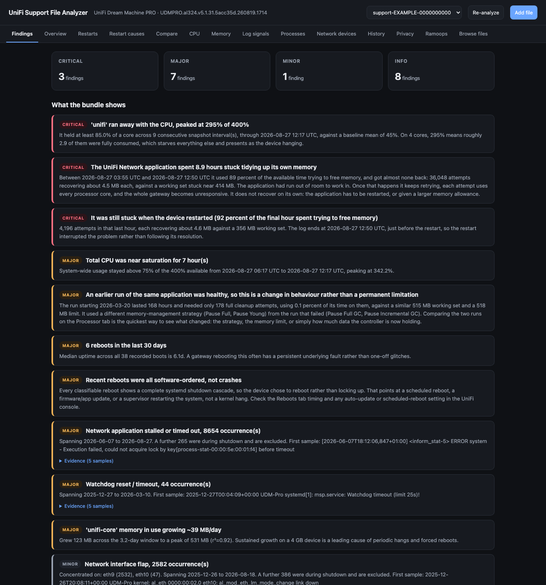
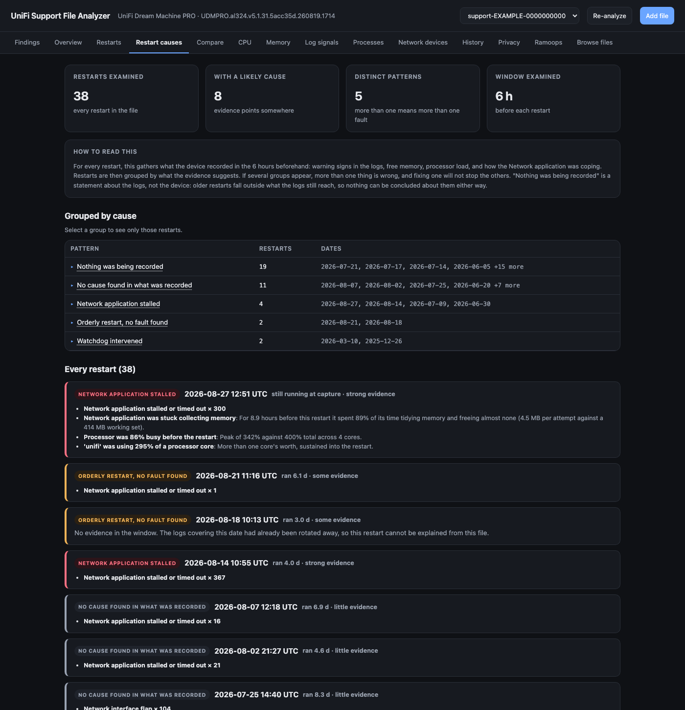
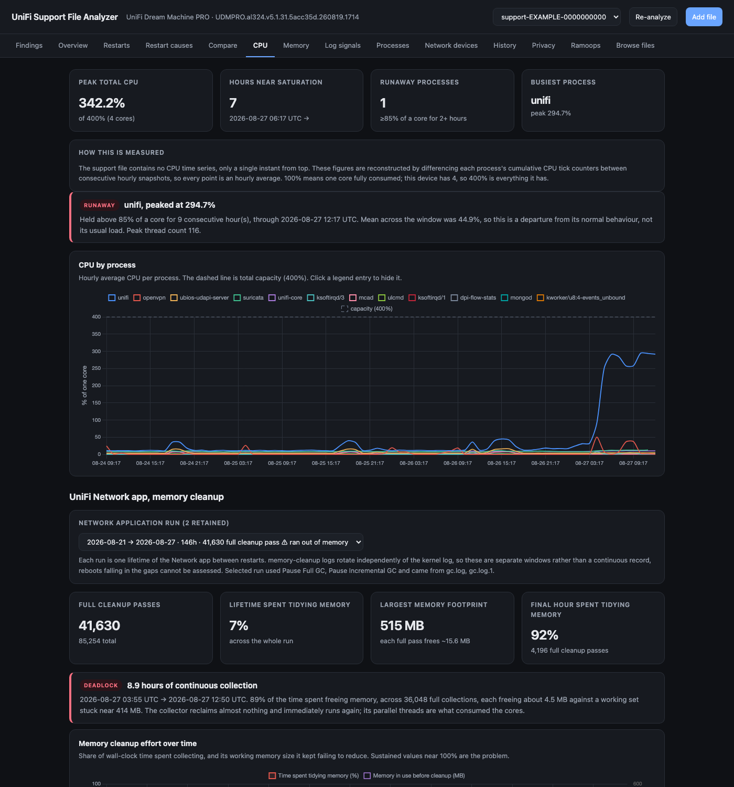
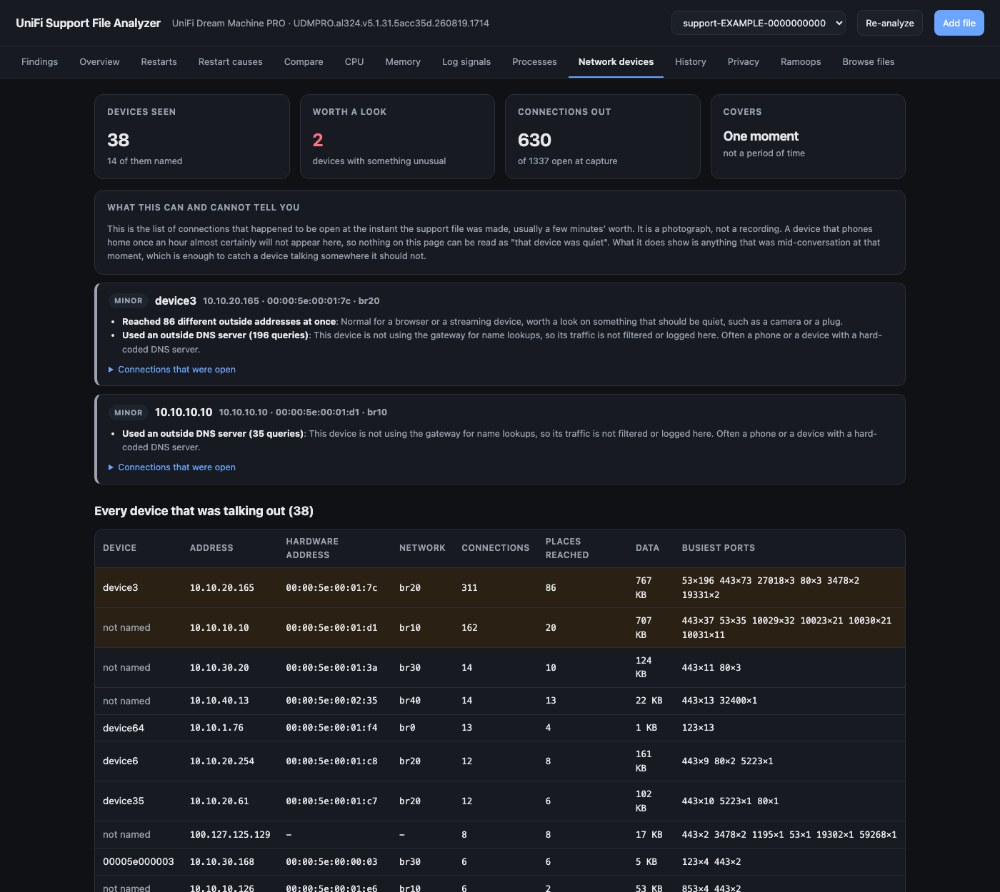
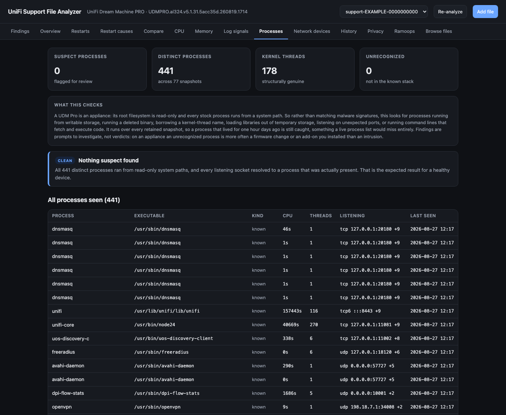
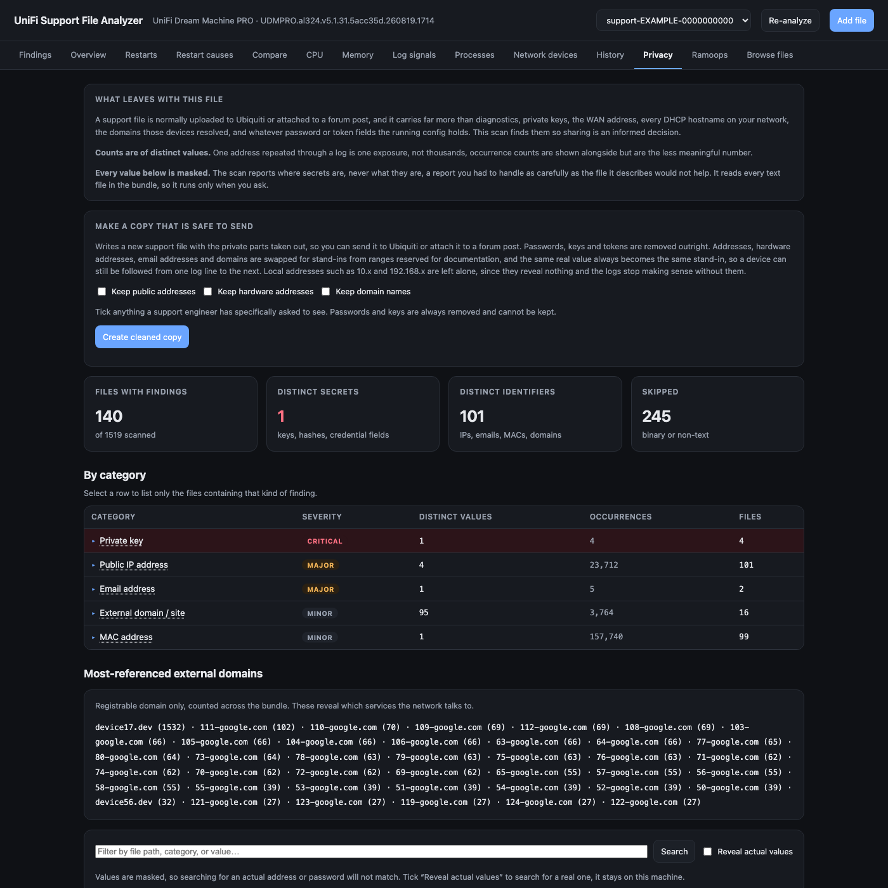
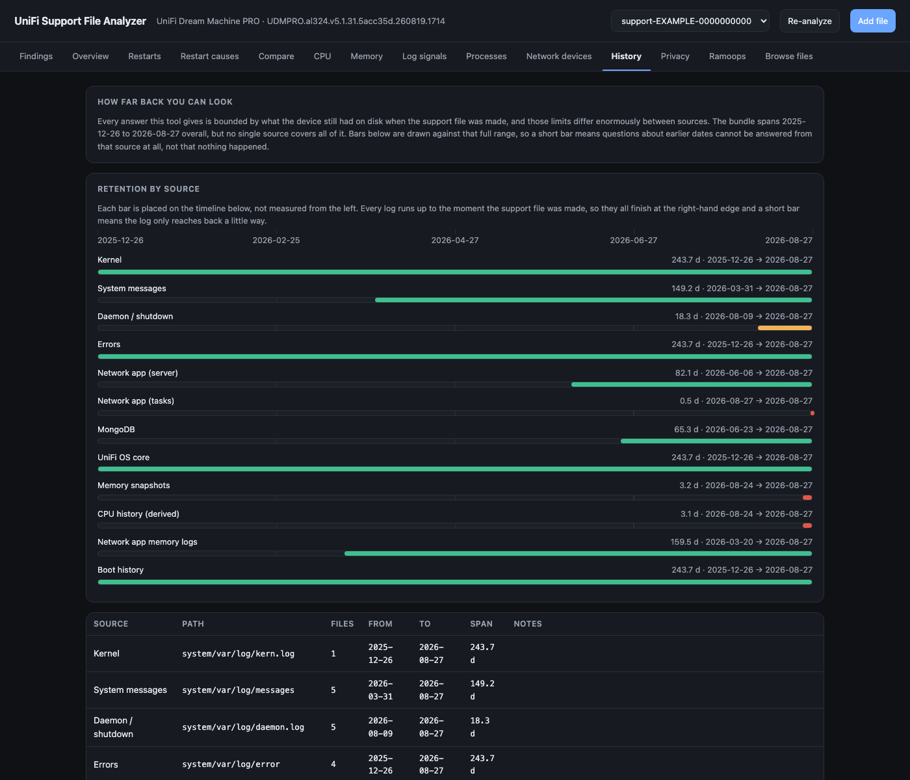

# UniFi Support File Analyzer

A UniFi support file is about 1,700 files and a few hundred megabytes of logs.
This reads it and answers the questions you actually have: why did the gateway
restart, what was using the processor, is anything running that should not be,
what are the devices on my network talking to, and what personal information
would I hand over if I sent this file to support.

It runs entirely on your own machine. There is no cloud service and no
telemetry. It reads files and never changes your device. It is not an official
Ubiquiti tool and has no connection to Ubiquiti.

> ### About how this was built
>
> This tool was written by prompting an AI, in conversation, rather than typed
> line by line. That is worth saying plainly, for two reasons.
>
> The first is transparency. You should know what you are running and judge it
> accordingly. Every analysis states the evidence it rests on and the limits of
> that evidence, and the code carries comments explaining why each rule is
> written the way it is, including the false alarms that shaped it. Where the
> support file cannot answer something, the tool says so instead of guessing.
> Read it, and check anything that matters before acting on it.
>
> The second is the point of the thing. A UniFi console tells you that something
> went wrong, rarely why. This exists to make the underlying evidence legible,
> so that you understand your own network better and so that a conversation with
> UniFi support can start from specifics such as "the Network application ran
> out of working memory for 8.9 hours before this restart, here is the log"
> rather than "it keeps rebooting". That tends to get to an answer faster.

## What it looks like

Every screenshot below comes from a real support file that was first put through
this tool's own cleaning step, so every address, device name and identifier in
them is a stand-in.

### Findings

What looks wrong, ranked, each with the evidence behind it. Here the Network
application had run out of working memory and pinned three of four processor
cores for nearly nine hours before the device restarted.



### Restart causes

Every restart checked against what was recorded in the six hours before it, then
grouped. On this device four restarts share one cause and the rest do not, which
means more than one fault, and explains why fixing one thing had not stopped
them.



### Processor

The support file holds no processor history at all, only a single instant. This
is rebuilt by comparing counters between hourly snapshots. The climb at the
right is one process taking almost three cores.



### Network devices

What each device behind the gateway was connecting to, with unusual
destinations flagged. It is a snapshot of connections that were open at capture,
not a period of monitoring, and the page says so rather than letting you read
too much into it.



### Processes

Every process seen across all retained snapshots, with anything outside the
normal UniFi software flagged: running from writable storage, running a deleted
file, borrowing a kernel thread's name, or listening on an odd port.



### Privacy

What a support file would reveal if you sent it. Values are masked, counts are
of distinct values rather than repetitions, and the button at the top writes a
cleaned copy you can actually share.



### History

How far back each log actually goes. Start here when an analysis looks empty,
because "nothing happened" and "nobody was writing it down" look identical
otherwise. Note the memory snapshots cover three days while the kernel log
covers eight months.



## Installing and running it

You need [Python 3.9 or newer](https://www.python.org/downloads/). Nothing else.
The first run creates its own isolated environment and installs what it needs.

<details>
<summary><b>Windows</b></summary>

Install Python from [python.org](https://www.python.org/downloads/windows/) and
tick **"Add python.exe to PATH"** during setup. Then, in PowerShell:

```powershell
git clone https://github.com/Inch-high/unifi-support-file-analyzer.git
cd unifi-support-file-analyzer
python run.py
```

Or download the project as a ZIP, unzip it, and double-click `run.bat`.

If Windows says `python` is not recognised, try `py run.py`.

</details>

<details>
<summary><b>macOS</b></summary>

macOS includes Python 3. In Terminal:

```bash
git clone https://github.com/Inch-high/unifi-support-file-analyzer.git
cd unifi-support-file-analyzer
python3 run.py
```

If macOS asks you to install developer tools the first time you run `git`,
accept, then run the commands again. You can also download the ZIP instead of
using git.

</details>

<details>
<summary><b>Linux</b></summary>

Most distributions ship Python 3. On Debian or Ubuntu you may need the
virtual-environment package first:

```bash
sudo apt install python3 python3-venv git
git clone https://github.com/Inch-high/unifi-support-file-analyzer.git
cd unifi-support-file-analyzer
python3 run.py
```

On Fedora: `sudo dnf install python3 git`. On Arch: `sudo pacman -S python git`.

</details>

Your browser opens at <http://127.0.0.1:8077>. Drag a support file onto the
page, or put it in the project folder before starting and it will be picked up.
You can also pass one directly:

```bash
python run.py ~/Downloads/support-XXXX-1234567890.tgz
```

Extracted files and cached analysis live in `data/`, which is excluded from git.
Analysis is cached per support file; "Re-analyze" forces a fresh pass.

### Getting a support file from your console

In the UniFi console: **Settings**, then **Control Plane**, then **Console**,
and choose to download the support file. It arrives as
`support-XXXX-NNNNNNNNNN.tgz`. Exact wording varies between UniFi OS versions.

## What the tabs show

- **Findings**: the ranked summary of what looks wrong and what it rests on.
- **Overview**: hardware, firmware, filesystems, disk health.
- **Restarts**: every restart, how long the device ran, and whether it was orderly.
- **Restart causes**: what the device recorded in the hours before each restart,
  grouped by cause. Separate groups mean separate faults, and fixing one will not
  stop the others.
- **Compare**: two captures measured against each other, to tell whether a change
  actually helped.
- **CPU**: per-process processor history, runaway detection, and how the Network
  application was coping with memory.
- **Memory**: system and per-process memory trends from the hourly snapshots.
- **Log signals**: lines matching known failure signatures, grouped, de-noised and
  filterable by date.
- **Processes**: every process seen across all snapshots, with anything that does
  not belong to the UniFi stack flagged for review.
- **Network devices**: what the machines behind the gateway were connecting to at
  the moment of capture, named from the lease table, with unusual destinations
  flagged.
- **History**: how far back each log actually reaches.
- **Privacy**: what personal data and secrets the file would carry if you sent it
  to Ubiquiti or posted it. Runs on demand, and every value is masked. Also
  produces a cleaned copy of the file that is safe to send.
- **Ramoops**: the kernel console preserved across the last restart.
- **Browse files**: any file in the bundle, decompressed, with search.

## What it is not

- Not official, and not affiliated with Ubiquiti.
- Not a monitor. It reads a file after the fact; it does not watch your network.
- Not a security scanner. It points out things worth a look and explains why, and
  an unfamiliar process is far more often a firmware change than an intrusion.
- Not a substitute for your own judgement. Findings are evidence and reasoning,
  meant to be checked.

## How long analysis takes, and what decides that

Analysing one support file takes roughly 10 to 15 seconds on a modern desktop,
and the privacy scan another 10 to 20. On an older laptop with a mechanical hard
disk, expect several times that. Two things set the pace.

**Processor cores.** Most of the work is matching patterns against millions of
log lines, which is pure computation. Files are analysed in parallel, one worker
per core, up to 12 workers, leaving two cores for everything else. On a
quad-core machine expect roughly three times slower than on a twelve-core one.
Set `ANALYZER_WORKERS` to override the count:

```bash
ANALYZER_WORKERS=4 python run.py
```

**Disk speed.** A support file is a few hundred megabytes once unpacked, spread
over about 1,700 files, and much of it is compressed and has to be read through.
On an SSD this is not the bottleneck. On a mechanical drive, or a network drive
or external disk over USB, it usually becomes the bottleneck, because the work
is thousands of small reads rather than one long one. Unpacking the file to
local storage before analysing it is worth doing.

Memory is not usually a constraint: about 1 GB is enough. Results are cached per
support file, so the cost is paid once, and "Re-analyze" is the only thing that
pays it again.

For reference, on an 18-core desktop with an SSD: full analysis 12.7 seconds,
privacy scan 13 seconds. The same work took 61 and 124 seconds before the
analysis ran across cores, and one algorithmic fix in the memory-cleanup log
reader accounted for 40 of that first 61.

## Reading it correctly

The bundle's own structure sets hard limits on what can be concluded, and the tool
reports those limits instead of guessing past them. Three are worth knowing:

**Reboot causes are only knowable for recent boots.** The kernel never writes its own
shutdown sequence to `kern.log`, by the time systemd tears down, syslog is already
gone, and that sequence survives only in ramoops. The systemd shutdown cascade
("Stopped target …") lands in `daemon.log`, which rotates far faster than `kern.log`.
So a boot is called:

- `clean`, the cascade is there, the device chose to reboot;
- `unclean`, logging ran right up to the reboot with no cascade, meaning a hang,
  watchdog reset, or power loss;
- `unknown`, the cascade-carrying log had already rotated away.

Which file carries the cascade differs between firmware versions, so the tool works it
out per bundle (by finding which log actually contains cascades) and measures coverage
against that file alone. Assuming `messages` would carry it produces confident-looking
"unclean" verdicts for every old boot, all of them false.

**Shutdown noise is separated from faults.** Every orderly reboot produces a flurry of
`Failed with result 'signal'` as services are killed. Those are consequences of the
reboot, not causes, so hits within 10 minutes before a boot are counted separately and
kept out of the headline numbers.

**CPU history is reconstructed, not recorded.** The bundle has no CPU time series, `top` is one instant at capture time and there is no `/proc/stat`. But every memory
snapshot stores each process's `/proc/<pid>/stat`, whose `utime`/`stime` counters are
cumulative. Differencing them between consecutive hourly snapshots recovers what each
process actually averaged over every hour, which is enough to catch a runaway loop.
Each point is therefore an hourly mean, a spike shorter than an hour gets averaged
down. 100% is one core saturated; the UDM Pro has 4, so 400% is everything.

Counters reset on process restart and on reboot, so samples are keyed by
`(pid, starttime)` rather than pid alone (pids get reused), and any interval spanning
a boot is dropped rather than reported as an enormous spike.

**A pegged CPU on this box is usually the Java controller's garbage collector.** When
the UniFi Network app's heap fills, the Network application does not fail cleanly, it enters a death
spiral of back-to-back Full GCs that each reclaim almost nothing while the parallel
collector threads saturate every core. The GC tab detects this from `unifi/logs/gc.log`
by looking for sustained windows where GC consumes most of wall-clock time while
reclaiming a negligible fraction of the heap. GC log timestamps are seconds since JVM
start, so they are placed on the real clock using the Network application's `starttime` from the process
snapshots plus the wall time of the boot that preceded that snapshot.

**The process audit trusts paths, not signatures.** A UDM Pro is an appliance: its
root filesystem is a read-only squashfs, and on a healthy device *every* userspace
process executes from a system path. That makes "is this running from somewhere it
could have been written to" a far better question than "does this binary match a known
signature", and it is one the bundle can actually answer. The audit flags executables
in writable storage, deleted binaries still running, kernel-thread names on userspace
processes, libraries loaded from temporary storage, notable listening ports, and
command lines that fetch-and-execute or open reverse shells.

Two design points matter more than the rule list. It runs over **every retained
snapshot**, so a process that lived for one hour three days ago is still caught, precisely the case a live `ps` misses. And it distinguishes **transient from
persistent** processes: snapshots catch short-lived commands mid-exec, before their
mappings exist, which looks identical to a process hiding its executable. Without that
distinction the audit flags `curl`, `logrotate` and every cron job, and the noise
buries anything real.

Findings are prompts to investigate, never verdicts. On an appliance the likeliest
cause of an unrecognized process is a firmware change or something you installed
yourself.

`tests/test_procaudit.py` builds synthetic snapshots containing a miner in `/tmp`, a
deleted binary, a kernel-thread impersonator, a reverse shell, an injected library and
a mapping-less resident process, then asserts each rule fires and that legitimate
processes stay clean. A detector that reports nothing on a healthy bundle is
indistinguishable from a broken one, so run this after changing any rule:

```bash
.venv/bin/python tests/test_procaudit.py
.venv/bin/python tests/test_tamper.py
.venv/bin/python tests/test_pii.py
.venv/bin/python tests/test_lan.py
.venv/bin/python tests/test_sanitise.py
```

**Sharing a support file leaks more than diagnostics.** The Privacy tab exists
because these files get uploaded to vendors and forums. A real bundle held 2 distinct
private keys, 179 distinct password/secret/token values, a password hash, the WAN
address, 479 MAC addresses, 969 public IPs and 122 external domains, enough to infer
which VPN provider and which services the network uses.

**Every finding is rendered, and every value can be searched.** An earlier version
capped the file list at 60 entries, which put the one genuinely personal email address
in a test bundle out of reach, it ranked 80th, so the summary said "1 email address"
while the list below showed none and Ctrl+F found nothing. A cap that isn't stated
reads as "this is everything". All files now render, category rows filter the list, and a search box matches on path, category or value.

Masking has the same trap: searching for your own address cannot match
`al*****@g****.com`. A **Reveal actual values** toggle re-runs the scan unmasked so
values are searchable. Revealed results are held in memory only and never written to
`data/`, the extracted bundle already sits on disk, and concentrating every secret
from it into one cache file is a risk not worth adding.

**Counts are of distinct values, and that distinction is not cosmetic.** Counting
occurrences instead reported "2,860 email addresses" for what was really *one*
address: a certificate subject repeated 2,610 times in a VPN log, kernel copyright
banners (`giometti@linux.it`, `Jason@zx2c4.com`), a package maintainer field, and a
log path (`/var/log/rabbitmq/rabbitmq@localhost.log`) that merely looks like an
address. After filtering software boilerplate and counting distinct values, the honest
figure is one genuinely personal address. Occurrence counts are still shown, as the
lesser number.

The scanner masks every value it reports (`password = hu*********et (13 chars)`,
`203.0.x.x`). It says *where* secrets are, never what they are: a report you had to
handle as carefully as the file it describes would be no help. `tests/test_pii.py`
asserts that no raw secret, email or WAN address appears anywhere in a full report.

Calibrating it against a real bundle removed four classes of false positive that
between them accounted for thousands of bogus "critical" hits: systemd unit names
contain the word *password* while their "value" is a status word; unit templates
like `getty@tty1.service` parse as email addresses; Go source filenames prefix log
lines as `vpn_private_key.go: ...`; and a QoS counter is called `ctokens`.

**Log integrity is content-based, because mtimes are worthless here.** The obvious
way to find a log edited after it was written is to compare mtime against content, and on this format that does not work at all: the support-file generator copies
everything at capture time, so 1,696 of 1,764 files share a four-minute mtime
window. The tool says so rather than implying an answer it cannot give.

What it uses instead is self-consistency, rotations abutting cleanly, timestamps
advancing, dense logs not going silent. Calibration mattered more than the rules:
a first pass produced 36 alarms on a healthy bundle because `messages` reorders at
every service teardown (syslog-ng flushing a daemon's buffer as it exits, which is
far more common than reboots) and `error` is silent for hours by nature. Both are
now judged per file, a log that reorders or goes quiet *habitually* is showing its
character, and only an isolated discontinuity is reported.

**The cleaned copy replaces consistently rather than blanking.** If every hardware
address became XXXXXX the file would be safe and useless, because following one
device through a log is most of what diagnosis is. Each distinct value instead gets
its own stand-in, reused everywhere it appears, drawn from ranges standards bodies
reserve for documentation (RFC 5737 for addresses, RFC 7042 for hardware addresses,
`.invalid` for names) so nothing can be mistaken for real or routed to. Passwords,
keys and tokens are simply removed, since correlating one occurrence of a password
with another has no value. Private addresses such as 10.x and 192.168.x are left
alone: they reveal nothing and the logs stop making sense without them.

The mapping is built in one pass before anything is rewritten. Letting each worker
invent its own stand-ins would break the guarantee that matters, one real value
appearing as one stand-in everywhere, and would let two real values collide onto one
stand-in, silently merging two machines into one.

Two bugs found by checking the output rather than trusting it, both worth knowing
about if you extend this. Compressed rotations were being copied through untouched,
which is 307 of 1,764 files and exactly the logs that carry addresses, so the export
was barely sanitised at all. And an address embedded in a longer string, as in the
monitoring command line `-B203.0.113.9-`, was missed entirely, because `\b` does
not match between a letter and a digit. That second bug was in the privacy scanner
too, so both got more accurate.

**The network view is a photograph, not a recording.** The connection table holds
what was open at the instant of capture, typically a few minutes' worth. A device
that beacons once an hour will not appear. Nothing there can be read as "that device
was quiet", only as "this is what was open at that moment".

**Retention differs wildly by source, so "no evidence" usually means "no logs".** In
one bundle the kernel log reached back eight months while the log carrying the systemd
shutdown cascade held eighteen days and the memory snapshots three. The History tab
draws every source against the bundle's full span for exactly this reason. Three
retention traps are handled rather than papered over:

- Dated archives such as `gc.log.1-2026040217.backup` sit outside the usual
  `.1`/`.2.gz` rotation naming and hold the *oldest* history present. Matching only
  numbered rotations silently truncates how far back anything can see.
- One bundle mixes at least three timestamp dialects, plain syslog, bracketed Java
  logs with comma milliseconds, and GC archives whose offset has no colon. A parser
  that handles only the first drops whole log families out of every time-based
  analysis, which looks identical to those files being empty.
- GC logs are per-JVM-run and rotate independently of everything else, so they form
  disconnected windows rather than a continuous record. All retained runs are analyzed
  and selectable, and the gaps between them are stated as gaps.

**Memory slopes are short-baseline.** Only a few days of hourly snapshots are retained, so each trend carries an r² and the window length. A dramatic MB/day figure with a low
r² is sawtooth churn, not a leak; the findings only call something a leak above both a
growth and a fit threshold.

Timestamps throughout are normalized to UTC, because these logs cross DST boundaries
and the bootlog directory names are stamped before NTP sync, comparing them naively
shifts intervals by an hour and can reorder events.

## Layout

```
analyzer/
  app.py        FastAPI server and JSON API
  bundle.py     extraction, workspace, analysis cache
  logutil.py    compressed-log reading, timestamp/timezone normalization
  overview.py   hardware, firmware, storage, SMART
  boots.py      boot history and clean/unclean classification
  coverage.py   retention span of every log family
  cpu.py        per-process CPU reconstruction and loop detection
  gclog.py      Java GC log parsing and death-spiral detection, all runs
  memory.py     snapshot parsing and trend fitting
  pii.py        privacy scan: secrets and personal data, masked
  forensics.py  what preceded each restart, and how restarts group
  lan.py        devices behind the gateway and what they were talking to
  sanitise.py   writes a cleaned copy of a support file
  compare.py    two captures measured against each other
  parallel.py   spreads per-file work across processor cores
  procaudit.py  process audit: anything outside the UniFi stack
  tamper.py     log-integrity checks (content-based, not mtime)
  logscan.py    failure-signature scan with noise filtering
  findings.py   ranked diagnostics
static/         single-page UI (vendored Chart.js, no CDN)
docs/           screenshots used by this README
tests/          synthetic-compromise tests for the process audit
```

## Adding a signature

Log patterns live in `analyzer/logscan.py` as
`(key, severity, regex, exclusion_regex, title)`. The exclusion regex is what keeps a
pattern honest, `thermal` matches the harmless `Thermal Sensor Loaded` printed at every
boot, and `watchdog` matches the `watchdog did not stop!` of every clean shutdown. Add
an entry to `GROUP_RES` if a finding should report *which* interface or service was
involved.
